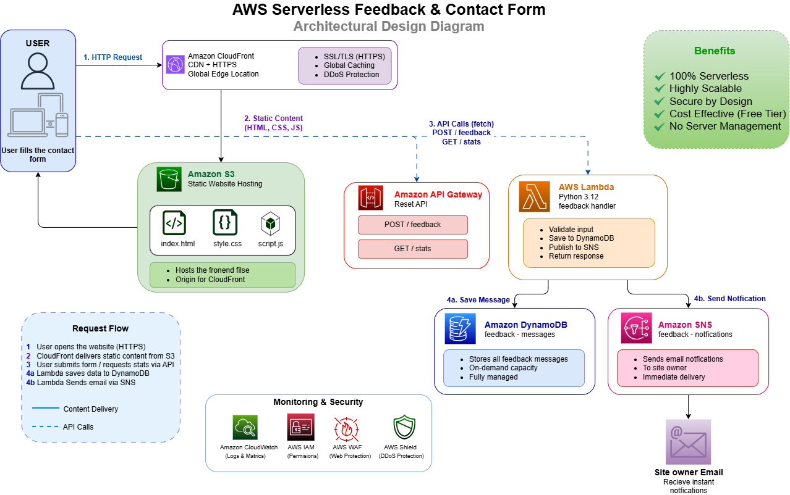

# AWS Serverless Feedback Form

AWS Serverless Feedback & Contact Form is a cloud-native, fully serverless application for collecting and managing user feedback. It uses `Amazon S3` and `CloudFront` for secure frontend delivery, `API Gateway` and `Lambda` for backend processing, and `DynamoDB` and `SNS` for data storage and real-time email notifications — with no traditional servers or EC2.

## 📋 Table of Contents

- [Overview](#-overview)
- [Architecture](#️-architecture)
- [AWS Services](#️-aws-services-used)
- [Project Structure](#-project-structure)
- [Deployment Steps](#-deployment-steps)
- [Testing](#-testing)
- [Troubleshooting](#-troubleshooting)
- [Cost Estimate](#-cost-estimate)
- [Cleanup](#-cleanup)
- [Future Improvements](#-future-improvements)
- [License](#-license)

## 🎯 Overview

**FeedbackHub** is a production-ready serverless contact form built entirely on AWS. Every submission is validated, saved to DynamoDB, and triggers an instant email notification via SNS — all while the frontend is delivered globally through CloudFront with zero server management.

## 🏗️ Architecture



The application follows a fully serverless request flow:

1. **User** opens the site over HTTPS.
2. **CloudFront** delivers the static frontend from **S3** (HTML, CSS, JS).
3. The form submits API calls (`POST /feedback`, `GET /stats`) to **API Gateway**.
4. **API Gateway** triggers the **Lambda** function (`feedback-handler`), which:
   - Validates the input
   - Saves the message to **DynamoDB** (`feedback-messages`)
   - Publishes a notification to **SNS** (`feedback-notifications`)
5. **SNS** sends an instant email notification to the site owner.

**Monitoring & Security:** Amazon CloudWatch (logs & metrics), AWS IAM (permissions), AWS WAF (web protection), and AWS Shield (DDoS protection).

## ⚙️ AWS Services Used

| Service | Resource Name | Purpose |
|---|---|---|
| **Amazon CloudFront** | — | CDN + HTTPS, global edge delivery for the frontend |
| **Amazon S3** | — | Static website hosting (HTML/CSS/JS), origin for CloudFront |
| **Amazon API Gateway** | `feedback-api` (REST API) | Exposes `POST /feedback` and `GET /stats` |
| **AWS Lambda** | `feedback-handler` (Python 3.12) | Validates input, writes to DynamoDB, publishes to SNS |
| **Amazon DynamoDB** | `feedback-messages` | Stores all feedback messages, on-demand capacity, fully managed |
| **Amazon SNS** | `feedback-notifications` | Sends instant email notification to the site owner |
| **AWS IAM** | `feedback-lambda-role` / `feedback-lambda-policy` | Grants Lambda access to DynamoDB and SNS |
| **Amazon CloudWatch** | — | Logs and metrics |
| **AWS WAF** | — | Web protection |
| **AWS Shield** | — | DDoS protection |

## 📁 Project Structure

```
AWS-Serverless-Feeback-Form/
├── Screenshot/
│   └── Arch.png            # Architecture diagram
├── index.html
├── style.css
├── script.js
├── lambda/
│   └── index.js            # feedback-handler Lambda code
├── template.yaml            # Infrastructure as Code (SAM/CloudFormation)
├── LICENSE
└── README.md
```

## 🚀 Deployment Steps

### Prerequisites
- An AWS account
- AWS CLI configured (`aws configure`)
- Node.js (for Lambda dependencies, if any)

### 1. Clone the repository
```bash
git clone https://github.com/Alaaaahmed2-M/AWS-Serverless-Feeback-Form.git
cd AWS-Serverless-Feeback-Form
```

### 2. Deploy the backend
```bash
sam build
sam deploy --guided
```
This provisions the `feedback-api` (API Gateway), `feedback-handler` (Lambda), `feedback-messages` (DynamoDB), and `feedback-notifications` (SNS topic), along with the required IAM role/policy.

### 3. Subscribe to email notifications
After deployment, confirm the SNS subscription email sent to the address configured for `feedback-notifications`.

### 4. Configure and deploy the frontend
Update the API endpoint URL in `script.js`, then upload to S3:
```bash
aws s3 sync . s3://your-bucket-name --acl public-read --exclude "lambda/*" --exclude "Screenshot/*"
```
Create a CloudFront distribution pointing to the S3 bucket for HTTPS delivery.

## 🧪 Testing

**Sample API Request**
```json
{
  "httpMethod": "POST",
  "path": "/feedback",
  "body": "{\"name\":\"Ahmed Test\",\"email\":\"test@example.com\",\"subject\":\"Hello!\",\"category\":\"general\",\"message\":\"This is a test message from Lambda.\"}"
}
```

**Expected Response**
```json
{
  "statusCode": 200,
  "body": "{\"message_id\": \"uuid-here\", \"message\": \"Your message has been sent successfully!\"}"
}
```

**Full Flow Checklist**

| Action | Expected Result |
|---|---|
| Open CloudFront URL | Form loads with modern design |
| Submit empty form | Validation error appears |
| Submit valid form | ✅ Green success message |
| Check your email | Notification email received |
| Open DynamoDB → Explore items | Message saved in table |
| Message counter | Updates to reflect new total |

## 🛠️ Troubleshooting

| Issue | Possible Cause | Fix |
|---|---|---|
| Form submits but no email received | SNS subscription not confirmed | Check inbox/spam for the confirmation email and confirm it |
| `403 Forbidden` on form submit | CORS not enabled on API Gateway | Enable CORS on the `/feedback` resource and redeploy the API |
| `500 Internal Server Error` | Lambda missing IAM permissions | Verify `feedback-lambda-role` has DynamoDB and SNS access |
| Page not loading via CloudFront | Distribution still deploying | Wait a few minutes; CloudFront deployments take 5–15 min |
| Old content still showing | CloudFront cache | Create a cache invalidation (`/*`) in the CloudFront console |

## 💰 Cost Estimate

| Service | Free Tier Limit | Expected Usage | Cost |
|---|---|---|---|
| Lambda | 1M requests/month | ~500 | $0 |
| API Gateway | 1M requests/month | ~500 | $0 |
| DynamoDB | 25GB + 200M requests | < 1MB | $0 |
| S3 | 5GB storage | < 1MB | $0 |
| CloudFront | 1TB transfer | Minimal | $0 |
| SNS | 1,000 emails/month | ~100 | $0 |

**💵 Total estimated monthly cost: $0.00**

## 🧹 Cleanup

To avoid any future charges, delete all resources in this order:

1. **CloudFront** → Disable distribution → wait → Delete
2. **S3** → Empty the bucket → Delete bucket
3. **API Gateway** → Delete `feedback-api`
4. **Lambda** → Delete `feedback-handler`
5. **DynamoDB** → Delete `feedback-messages` table
6. **SNS** → Delete subscription → Delete `feedback-notifications` topic
7. **IAM** → Delete `feedback-lambda-role` → Delete `feedback-lambda-policy`

## 🔮 Future Improvements

- [ ] Add Amazon Cognito for admin dashboard with login
- [ ] Add SES (Simple Email Service) to send a reply to the user
- [ ] Add CloudWatch Dashboard for message analytics
- [ ] Add rate limiting in API Gateway to prevent spam
- [ ] Store message attachments in S3
- [ ] Add spam filter using AWS Comprehend

## 📄 License

This project is open source and available under the [MIT License](LICENSE).
